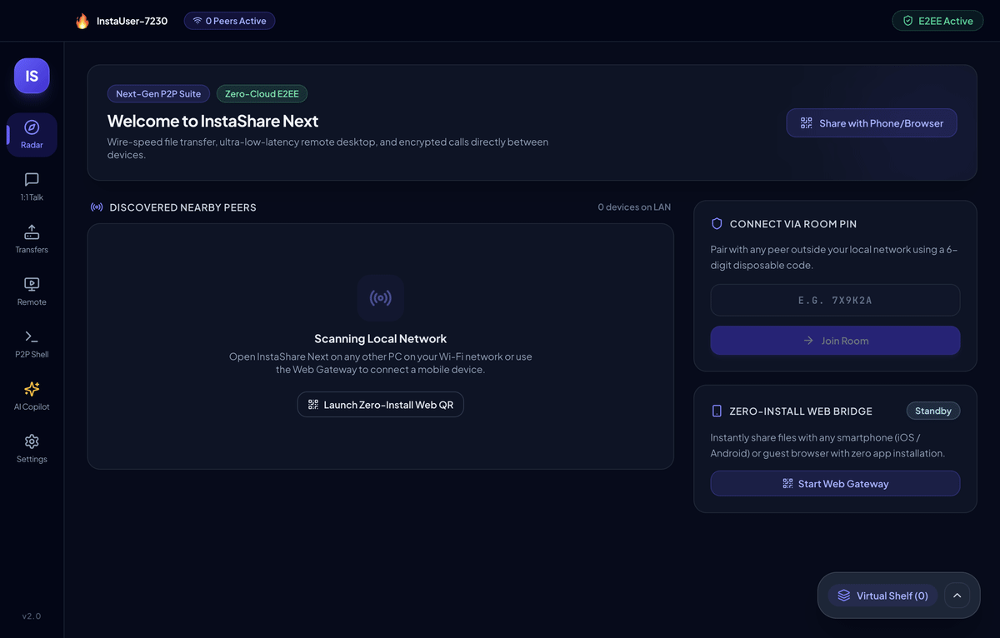
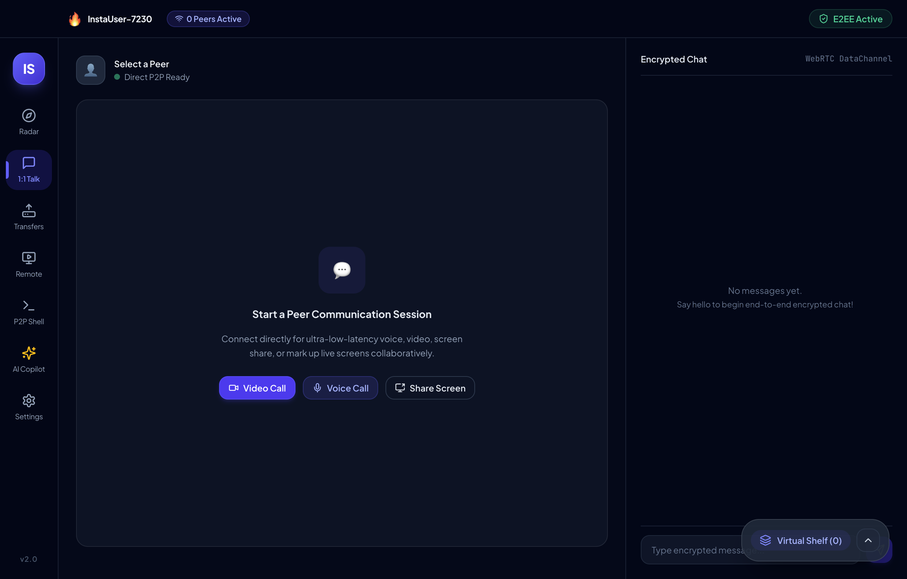
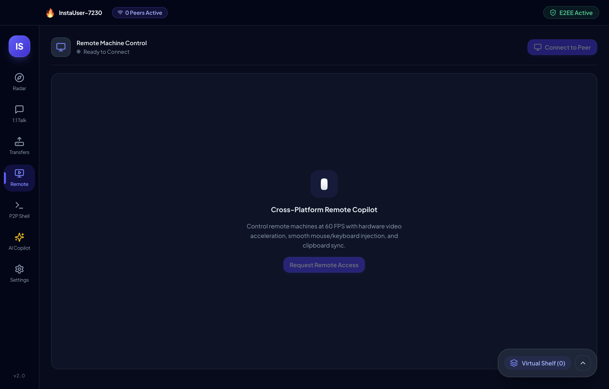
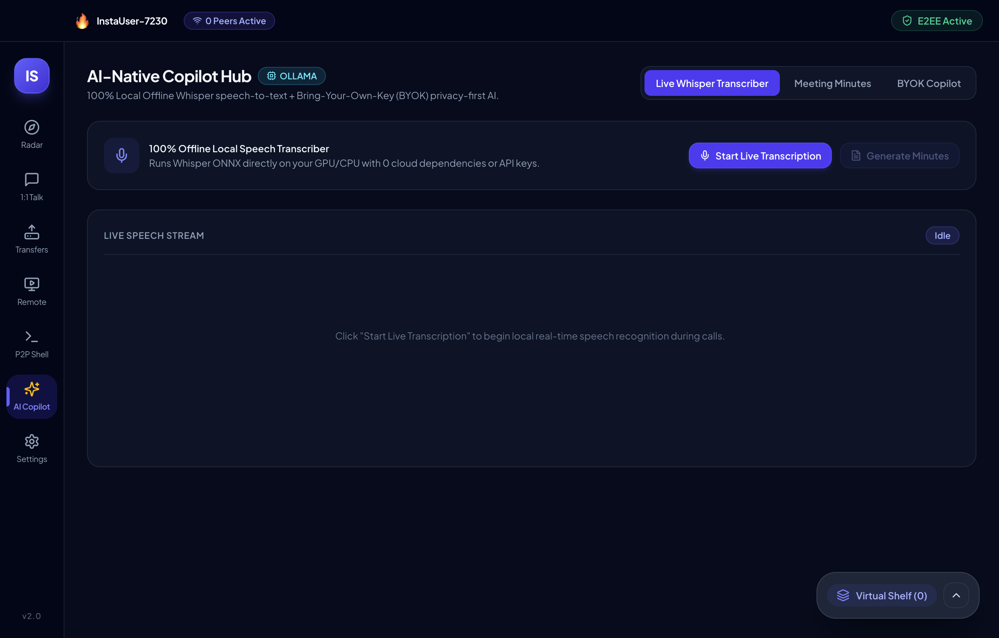
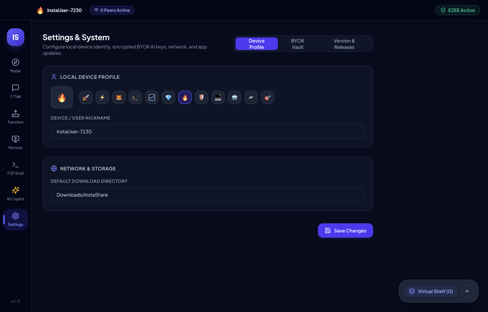

<div align="center">

# ⚡ InstaShare Next (v2.0)

### *The 100% Free & Open-Source, Zero-Cloud P2P Desktop Suite*
**Wire-Speed File Transfers • 60 FPS Remote Desktop • Encrypted Calls • P2P Terminal Pairing • 100% Offline Whisper AI**

[](https://opensource.org/licenses/MIT)
[](https://github.com/gaurav10610/theinstashare-desktop)
[](https://github.com/gaurav10610/theinstashare-desktop)
[](https://www.electronjs.org/)
[](https://react.dev/)

<br/>



<br/>

[**Download Latest Release**](https://github.com/gaurav10610/theinstashare-desktop/releases) • [**Features**](#-killer-features) • [**Comparison Matrix**](#-how-instashare-next-compares) • [**Quick Start**](#-quick-start--development)

</div>

---

## 🎯 Why InstaShare Next?

Today's remote collaboration tools are fragmented, bloated with SaaS subscriptions, and siphon your private data to cloud servers. **InstaShare Next** unifies everything you need into a single, ultra-lightweight, native desktop application that runs **100% peer-to-peer directly between your devices**:

- 🚫 **Zero Subscriptions & Zero Cloud Telemetry:** No servers storing your files, video calls, or keystrokes.
- ⚡ **Wire-Speed Line Rate:** Automatically routes transfers across local LAN/Wi-Fi sockets up to **10 Gbps**.
- 📱 **Zero-Install Web Guest Bridge:** Share files and screen streams with iOS/Android smartphones via an instant QR code—no app install required.
- 💻 **Hardware Remote Desktop (60 FPS):** Low-latency native input automation across macOS, Windows, and Linux.
- 🤖 **100% Local Offline AI Whisper:** Transcribe calls and generate meeting minutes on-device with 0 cloud calls and 0 API keys.

---

## 📸 Product Walkthrough & Real Screenshots

<table align="center" width="100%">
  <tr>
    <td width="50%" align="center">
      
      <br/>
      <b>📡 Local Peer Radar & Quick Connect</b>
      <p><i>Sub-millisecond UDP multicast discovery, 6-digit room PINs, and Web Gateway.</i></p>
    </td>
    <td width="50%" align="center">
      
      <br/>
      <b>⚡ Hyper-Stream File Hub & Live Folder Sync</b>
      <p><i>Zero-RAM backpressure streaming with BLAKE3 chunk block healing.</i></p>
    </td>
  </tr>
  <tr>
    <td width="50%" align="center">
      
      <br/>
      <b>🖥️ 60 FPS Remote Desktop & Copilot</b>
      <p><i>Sub-pixel Retina/DPI scaling, native input engine, and Privacy Shield.</i></p>
    </td>
    <td width="50%" align="center">
      
      <br/>
      <b>⌨️ P2P Interactive Shell & AI Debugger</b>
      <p><i>Collaborative terminal pairing over WebRTC with AI command diagnostics.</i></p>
    </td>
  </tr>
  <tr>
    <td width="50%" align="center">
      
      <br/>
      <b>🤖 100% Local Offline Whisper & BYOK AI</b>
      <p><i>On-device speech transcription and multi-provider AI vault (Claude/Gemini/Ollama).</i></p>
    </td>
    <td width="50%" align="center">
      
      <br/>
      <b>🔐 Local SafeStorage Vault & System Settings</b>
      <p><i>OS-level encrypted keyring (macOS Keychain / Windows DPAPI / Linux Secret Service).</i></p>
    </td>
  </tr>
</table>

---

## 📊 How InstaShare Next Compares

| Feature | **InstaShare Next** ⚡ | LocalSend | RustDesk | Snapdrop | AirDrop | AnyDesk |
| :--- | :---: | :---: | :---: | :---: | :---: | :---: |
| **License & Price** | **100% Free & Open Source** | Open Source | Open Core | Open Source | Proprietary | Paid SaaS ($14.90+/mo) |
| **Cross-Platform** | **macOS, Windows, Linux, Mobile** | macOS, Win, Linux, Mobile | macOS, Win, Linux, Mobile | Web Browser Only | Apple Devices Only | macOS, Win, Linux, Mobile |
| **Zero-Install Web Guest QR** | ✅ **Yes (Built-in)** | ❌ No | ❌ No | ✅ Yes (WebRTC) | ❌ No | ❌ No |
| **Unlimited Zero-RAM Streaming** | ✅ **Yes (BLAKE3 Stream)** | ⚠️ Memory-buffered | ❌ No | ⚠️ Browser RAM limit | ✅ Yes | ❌ No |
| **60 FPS Hardware Remote Desktop**| ✅ **Yes (@nut-tree N-API)**| ❌ No | ✅ Yes | ❌ No | ❌ No | ✅ Yes |
| **Collaborative P2P Terminal (PTY)**| ✅ **Yes (xterm + pty)** | ❌ No | ⚠️ Basic CLI | ❌ No | ❌ No | ❌ No |
| **1:1 Encrypted Audio/Video Calling**| ✅ **Yes (Opus/VP9 E2EE)** | ❌ No | ❌ No | ❌ No | ⚠️ FaceTime only | ⚠️ Audio only |
| **Live Screen Annotation & Laser**| ✅ **Yes (Real-time Canvas)**| ❌ No | ⚠️ Basic whitebd | ❌ No | ❌ No | ✅ Yes |
| **Ad-Hoc Live Synced Folders** | ✅ **Yes (chokidar delta)** | ❌ No | ❌ No | ❌ No | ❌ No | ❌ No |
| **100% Offline AI Transcriber** | ✅ **Yes (Whisper ONNX)** | ❌ No | ❌ No | ❌ No | ❌ No | ❌ No |
| **Pre-Flight Security Sanitizer** | ✅ **Yes (.env Leak Shield)**| ❌ No | ❌ No | ❌ No | ❌ No | ❌ No |
| **Memory Footprint at Idle** | **$< 80\text{ MB}$** | $\approx 90\text{ MB}$ | $\approx 150\text{ MB}$ | $\approx 120\text{ MB}$ | OS Integrated | $\approx 220\text{ MB}$ |

---

## 🚀 Killer Features

### 1. ⚡ Zero-Config Hybrid Transport & Web Guest Bridge
- **Subnet Wire-Speed Line Rate:** Sub-millisecond mDNS & UDP Multicast (`239.255.255.250:53535`) discovery routes data over local LAN sockets (up to 10 Gbps).
- **Global WebRTC ICE:** Seamless hole-punching for peers across different networks and NATs.
- **Zero-Install Web Gateway:** Generate a local QR code; any smartphone (iOS / Android) or guest browser can download/upload files and view your screen without installing any app.

### 2. 🗂️ Zero-RAM Hyper-Stream File Transfer & Live Folder Sync
- **Stream Unlimited Sizes:** Transfer 100GB+ files or directory trees with flat $<100\text{ MB}$ RAM consumption using chunk backpressure streams.
- **BLAKE3 Hash Block Healing:** Instant sub-millisecond cryptographic chunk verification with automatic resume on reconnect.
- **Ad-Hoc Live Synced Folders:** Right-click any folder to establish a live two-way delta sync mirror powered by `chokidar`.
- **Pre-Flight Security Shield:** Scans and warns before transmitting `.env` files, leaked API tokens, and strips OS junk (`.DS_Store`, `node_modules`).

### 3. 🖥️ 60 FPS Remote Desktop Copilot & P2P Shell
- **Hardware-Accelerated Remote Desktop:** Ultra-low latency input injection via `@nut-tree/nut-js` N-API bindings across macOS, Windows, and Linux.
- **Sub-Pixel Retina & DPI Scaling:** Flawless coordinate transformation across mismatched display resolutions and aspect ratios.
- **Privacy Shield:** Automatically black out sensitive windows (e.g. password managers, banking tabs) from remote video feeds.
- **P2P Remote Terminal (`xterm.js` + `node-pty`):** Real-time collaborative shell pairing over encrypted WebRTC DataChannels with integrated AI Command Debugger.

### 4. 📞 Encrypted Audio/Video Calling & Screen Markup
- **Opus & VP9/AV1 Calling:** High-fidelity encrypted calling with system sound loopback.
- **Live Screen Markup & Laser Pointer:** Draw arrows, highlights, boxes, and use real-time laser pointers directly on top of active screen streams.

### 5. 🤖 Dual-Mode Privacy-First AI Copilot
- **100% Local Offline Whisper:** On-device speech-to-text powered by `@xenova/transformers` (Whisper ONNX via WebGPU/WASM in Web Workers). Generates Markdown meeting minutes and action items with 0 cloud calls and 0 API keys.
- **Bring-Your-Own-Key (BYOK):** Multi-provider AI workspace supporting Google Gemini 2.0, Anthropic Claude 3.5 Sonnet, OpenAI GPT-4o, Groq, and 100% offline Local Ollama.
- **SafeStorage Vault:** Keys are encrypted on your local machine using macOS Keychain / Windows DPAPI / Linux Secret Service.

---

## 🛠️ Technology Stack

```text
├── Desktop Shell: Electron 34+ (Context Isolation, Typed ContextBridge)
├── Bundler & Build Engine: electron-vite 3 + Vite 6
├── Frontend Framework: React 19 + TypeScript 5.7
├── Design System: Tailwind CSS v4 + Material Design 3 (M3) Reusable Tokens
├── State Engine: Zustand 5 + Immer (Pure Functional State Machines)
├── Networking: WebRTC 2.0 DataChannels + multicast-dns + Node.js HTTP/WS
├── Input & Terminal: @nut-tree-fork/nut-js + node-pty + xterm.js
├── Local Speech AI: @xenova/transformers (Whisper ONNX WebGPU)
├── Cryptography: @noble/hashes (BLAKE3 & SHA-256)
└── Test Engine: Vitest 4.x (54 Automated Tests across 15 Suites)
```

---

## 📦 Quick Start & Development

### Prerequisites
- Node.js $\ge 18.0.0$
- npm $\ge 9.0.0$

### 1. Clone & Install
```bash
git clone https://github.com/gaurav10610/theinstashare-desktop.git
cd theinstashare-desktop
npm install --legacy-peer-deps
```

### 2. Run Local Development (Instant HMR)
```bash
npm run dev
```

### 3. Run Multi-Instance Test (Alice ⟷ Bob)
```bash
./scripts/launch-multi-instance.sh
```

### 4. Run Test Suite & Typecheck
```bash
npm run typecheck   # Strict TypeScript checks across Node & Web
npm test            # Runs full 54-test automated suite
```

### 5. Build Local Release Binaries (100% Offline)
```bash
npm run release          # Build for current OS (macOS DMG/Zip)
npm run release:mac      # macOS DMG (Apple Silicon & Intel)
npm run release:win      # Windows NSIS Installer (.exe)
npm run release:linux    # Linux AppImage & Debian package
npm run release:all      # Build all targets simultaneously
```

---

## 📜 Historical Codebase
The legacy Angular 12 / RobotJS codebase has been archived in [`archive/legacy-angular-v1/`](./archive/legacy-angular-v1/LEGACY_README.md).

---

## 📄 License
Released under the **[MIT License](LICENSE)**. Free and open-source forever. Built with ❤️ by Gaurav Kumar Yadav.