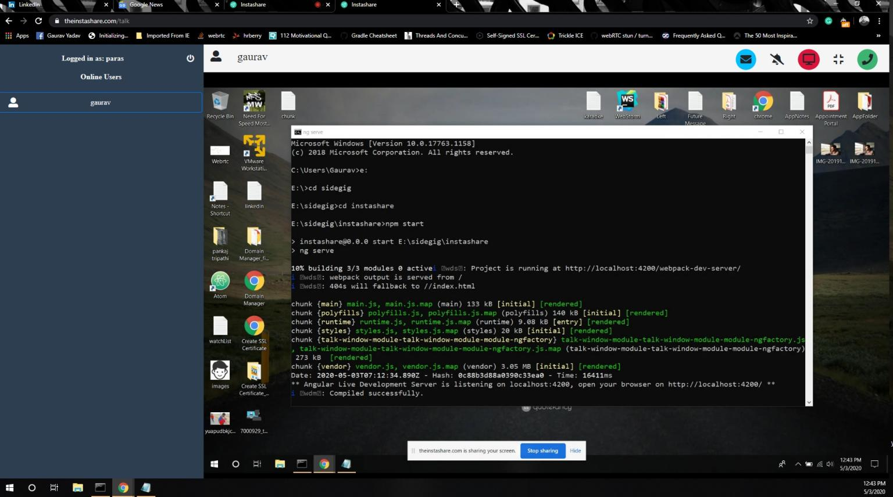

# theinstashare-desktop
theinstashare-desktop is a cross platform desktop app. This is the desktop version of TheInstashare app which is a free peer to peer media streaming service built on top of WebRTC tech stack. Every feature is powered by the underlying peer to peer streaming capabilities provided by WebRTC stack. Product is still very much under active development. 

### Try web version at - https://theinstashare.com/

Currently, it supports the following features -

### Major Features - 
- Text Chat
- Audio Chat
- Video Chat
- Screen Sharing
- File Sharing
- Access Remote Machine
- Share Remote Access (Share keyboard and mouse control with a remote user)

NOTE - For web version of the app please follow following github repo - 

```
https://github.com/gaurav10610/theinstashare-web
```

### Minor Features - 
- Flip Camera
- Do not disturb
- Mute
- Full-Screen Mode
- Shared Media Download
- Automatic reconnection attempt

### Important points - 
- TheInstashare app uses opinionated one webrtc connection per media track approach while streaming media tracks.
- All the newly created webrtc connections will get closed as soon as user choose to stop media streaming.
- Text messages exchange, file transfer and streaming of remote access events(relaying of mouse and keyboard events) is powered by webrtc data channels.
- Idle webrtc datachannels will automatically get cleaned up along with webrtc connections by a recurring job if there is no exchange of information via datachannel from certain configured time.

### Steps to build the app - 
```
npm install
npm run electron:build
#packaged app will be placed in release folder
```

### Screenshots -


 
 



### Credits - 
- App bootstrapped using awesome [angular-electron](https://github.com/maximegris/angular-electron) project

### Author - 
Gaurav Kumar Yadav

Email - gaurav10610@gmail.com

Linkedin - https://www.linkedin.com/in/gaurav-kumar-yadav-6125817a/